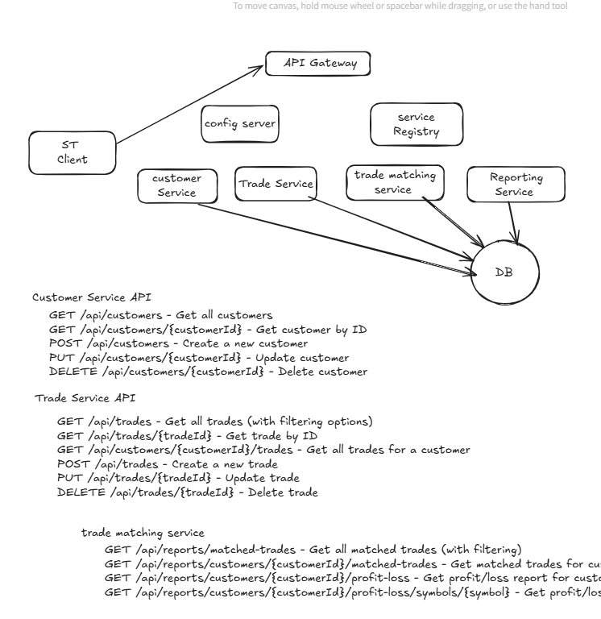

# Trade Management System - Microservices Architecture

## System Overview

This system is a distributed trade management platform built using microservices architecture with the following core components:



## Architecture Components

### Core Services

1. **API Gateway** - Single entry point for all client requests
2. **Config Server** - Centralized configuration management
3. **Service Registry** - Service discovery and registration
4. **Customer Service** - Manages customer data and accounts
5. **Trade Service** - Handles trade execution and management
6. **Trade Matching Service** - Processes trade matching and reconciliation
7. **Reporting Service** - Generates financial reports and analytics

## API Documentation

### Customer Service API


| Endpoint                      | Method | Description         |
| ----------------------------- | ------ | ------------------- |
| `/api/customers`              | GET    | Get all customers   |
| `/api/customers/{customerId}` | GET    | Get customer by ID  |
| `/api/customers`              | POST   | Create new customer |
| `/api/customers/{customerId}` | PUT    | Update customer     |
| `/api/customers/{customerId}` | DELETE | Delete customer     |

### Trade Service API


| Endpoint                             | Method | Description                     |
| ------------------------------------ | ------ | ------------------------------- |
| `/api/trades`                        | GET    | Get all trades (with filtering) |
| `/api/trades/{tradeId}`              | GET    | Get trade by ID                 |
| `/api/customers/{customerId}/trades` | GET    | Get trades for customer         |
| `/api/trades`                        | POST   | Create new trade                |
| `/api/trades/{tradeId}`              | PUT    | Update trade                    |
| `/api/trades/{tradeId}`              | DELETE | Delete trade                    |

### Trade Matching & Reporting API


| Endpoint                                                           | Method | Description                     |
| ------------------------------------------------------------------ | ------ | ------------------------------- |
| `/api/reports/matched-trades`                                      | GET    | Get all matched trades          |
| `/api/reports/customers/{customerId}/matched-trades`               | GET    | Get matched trades for customer |
| `/api/reports/customers/{customerId}/profit-loss`                  | GET    | Get profit/loss report          |
| `/api/reports/customers/{customerId}/profit-loss/symbols/{symbol}` | GET    | Get profit/loss by symbol       |

## System Features

1. **Customer Management**

   - Full CRUD operations for customer accounts
   - Secure data access
2. **Trade Execution**

   - Record new trades
   - Update existing trades
   - Comprehensive trade queries
3. **Trade Reconciliation**

   - Trade matching functionality
   - Discrepancy identification
4. **Financial Reporting**

   - Profit/loss calculations
   - Symbol-specific performance
   - Customer portfolio analysis

## Development Setup

1. **Prerequisites**

   - Java 17+
   - Spring Boot 3.x
   - Docker (for containerized deployment)
   - PostgreSQL (recommended for production)
2. **Running Locally**

   ```bash
   # Start service registry first
   cd service-registry
   mvn spring-boot:run

   # Then start other services
   ```
